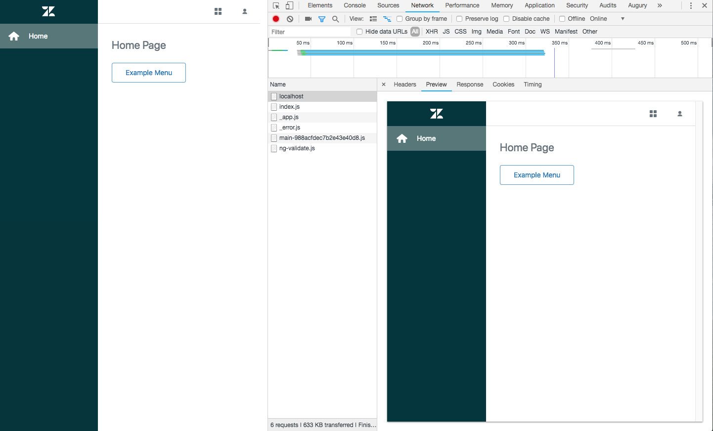

## Next.js and Garden Example

This example shows how to consume Garden React components within a [Next.js](https://nextjs.org/) (server side rendering) project.



## How to use

### Build Garden Dependencies

Installs dependencies and builds Garden components

```bash
# ~/react-components

yarn install
```

### Run Next.js Project

Install Next.js dependencies and start in development mode

```bash
# ~/react-components/examples/nextjs

yarn install
yarn dev
```
